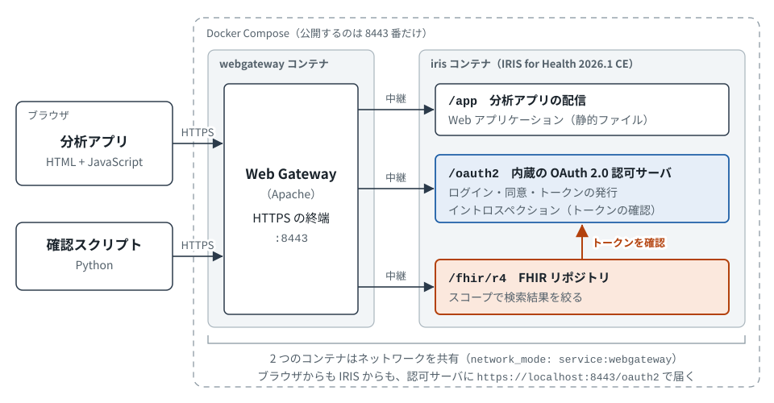

# SMART v2 スコープ × IRIS for Health 2026.1（内蔵の認可サーバ）

IRIS for Health 2026.1 Community Edition だけで、SMART on FHIR v2 の細粒度スコープ（例: `user/Observation.rs?category=laboratory`）を発行し、FHIR リポジトリが返すデータをスコープで絞るデモです。Keycloak や Auth0 などの外部の認可サーバは使いません。

- IRIS に内蔵の OAuth 2.0 認可サーバが、`?category=laboratory` のような条件付きのスコープを発行する
- FHIR リポジトリが、アクセストークンのスコープに応じて検索結果を絞る
- ブラウザの分析アプリ（認可コードフロー + PKCE、ライブラリなし）で、スコープを変えたときのトークンの中身と集計結果を並べて見る
- fhirUser クレーム、患者コンテキスト（patient/ スコープ）、smart-configuration も動かす

解説記事: InterSystems 開発者コミュニティ（投稿後にリンクを入れます）

## 構成



IRIS のコンテナは Web Gateway のコンテナとネットワークを共有しています。IRIS の中から見た `localhost:8443` も Web Gateway になるので、ブラウザと IRIS のどちらからも、認可サーバ（発行元）に同じ `https://localhost:8443/oauth2` で届きます。hosts ファイルの編集は不要です。

| フォルダ | 内容 |
|---|---|
| `iris/src/sys/` | 環境を作るクラス（`Demo.Setup`）。`%SYS` に読み込む |
| `iris/src/hssys/` | 認可サーバの検証クラス（`Demo.OAuth2.Validate`）。fhirUser クレームを入れる。認可サーバのカスタマイズ用ネームスペース（HSSYS）に読み込む |
| `iris/app/` | 分析アプリ。IRIS の Web アプリケーション `/app` で配信する |
| `iris/data/fhir/` | サンプルデータ（デモの医師 1 名と、Synthea の合成患者 8 名） |
| `webgateway/` | Web Gateway の設定と起動スクリプト。証明書は起動時に `certs/` に作られる |
| `checker/` | 確認スクリプト（Python） |
| `tools/synthea/` | 合成患者データを作り直すスクリプト |
| `tools/browser-test/` | 分析アプリをヘッドレスの Chromium で操作するテスト（任意） |
| `shared/` | IRIS が起動後に書き出す設定（発行元、クライアント ID、デモ用の利用者） |
| `docs/` | README の構成図 |

## 前提

- Docker と Docker Compose v2 以降。ホストの 8443 番ポートが空いていること
- ディスクの空き 10 GB 程度（IRIS for Health のイメージと、ビルドしたイメージの合計が約 9 GB）
- 確認スクリプトを動かす場合: Python 3.10 以降と requests（Ubuntu 22.04 では `sudo apt install python3-requests`）

動作を確認した環境は次のとおりです。

| 項目 | 版 |
|---|---|
| OS | Windows 11 の WSL2（Ubuntu 22.04.5 LTS） |
| Docker | Docker Engine 29.7.2、Docker Compose 2.23.3 |
| IRIS | `containers.intersystems.com/intersystems/irishealth-community:2026.1`、`containers.intersystems.com/intersystems/webgateway:2026.1` |
| Python | 3.10.12（requests 2.25.1） |
| ブラウザ | Google Chrome（Windows） |

## 起動

```bash
git clone https://github.com/lead-kojima/iris-smart-v2-scopes-demo.git
cd iris-smart-v2-scopes-demo
docker compose up -d --build
docker compose logs -f iris
```

ログに `[Demo.Setup] Runtime done` が出たら準備完了です。`Ctrl+C` でログの表示を終えます。初回は IRIS for Health のイメージ（約 4.6 GB）の取得にも時間がかかります。イメージのビルドは 3〜4 分です。

`docker compose ps` で、2 つのコンテナが `healthy` になっていることも確かめられます。

## 分析アプリ

ブラウザで https://localhost:8443/app/ を開きます。自己署名証明書なので、ブラウザが警告を出します。Chrome では「詳細設定」を押し、「localhost にアクセスする（安全ではありません）」を選ぶと進めます。

1. 左の「① スコープを選んでログイン」で組み合わせを選び、「ログインしてトークンを受け取る」を押す
2. IRIS のサインイン画面で `doctor01` / `Doctor01-demo` を入力して「サインイン」を押す。同意画面に要求したスコープが並ぶので、「許可」を押す
3. 左の「② 受け取ったトークン」で、要求したスコープ、発行されたスコープ、fhirUser、有効期限を確かめる。右上のタブ（認可サーバ情報、アクセストークン情報、ID トークン情報）で、smart-configuration とトークンの中身を切り替えて見る
4. 中央の「③ データを検索して集計」で「Observation 検索」を押す。③の欄に取得件数とカテゴリごとの件数、下段に項目ごと・患者ごとの件数が表示される（下段の表は、それぞれの枠の中でスクロールする）

| 組み合わせ | 要求するスコープ（openid fhirUser は省略） | 結果 |
|---|---|---|
| 検査結果だけ | `user/Observation.rs?category=laboratory` | 検査の Observation だけが返る |
| バイタルだけ | `user/Observation.rs?category=vital-signs` | バイタルだけが返る |
| 検査とバイタル | 上の 2 つ | どちらかに当てはまるものが返る |
| 問診票だけ | `user/Observation.rs?category=survey` | 問診票だけが返る |
| すべての観察データ | `user/Observation.rs` | Observation がすべて返る |
| 患者情報だけ | `user/Patient.rs` | Observation の検索はエラーにならず 0 件 |
| 1 人の患者の検査結果 | `launch/patient patient/Observation.rs?category=laboratory` | 指定した患者の検査結果だけが返る |
| 登録していないスコープ | `user/Observation.rs?category=social-history` | 認可サーバが `invalid_scope` で拒否する |

「1 人の患者の検査結果」で使う患者 ID は、集計結果の「患者ごと」の表にある「この患者だけに絞る」で入力できます。アクセストークンの有効期限は 5 分です。期限が切れたら、もう一度ログインしてください。

## 新しい細粒度スコープを試す

認可サーバにスコープを登録するだけで、FHIR リポジトリの設定を変えずに新しい絞り込みを試せます。たとえば、未登録の `user/Observation.rs?category=social-history` を登録します。

1. 管理ポータル（https://localhost:8443/csp/sys/UtilHome.csp、`SuperUser` / `SYS`）で、［システム管理］>［セキュリティ］>［OAuth 2.0］>［サーバ］を選ぶ。「OAuth 2.0 認可サーバ構成」画面が開く
2. 「スコープ」タブで「サポートしているスコープを追加」を押す。「サポートするスコープを入力」に `user/Observation.rs?category=social-history`、「スコープの説明を入力」に説明（例: 生活歴の Observation）を入れて「OK」を押す
3. 画面上部の「保存」を押す。「認証構成を正常に保存しました」と表示される
4. 分析アプリで「登録していないスコープ」を選んでログインする。同意画面には、手順 2 で入れた説明が表示される。「Observation 検索」を押すと、今度はトークンが発行され、生活歴（social-history）の Observation 9 件だけが返る

コンテナを作り直すと、この変更は消えます。残す場合は、`iris/src/sys/Demo/Setup.cls` の `SCOPES` に追加します。アプリのボタンに加える場合は、`iris/app/app.js` の `PRESETS` にも追加します。

## 確認スクリプト

どちらもプロジェクトのフォルダで実行します。ブラウザの代わりに、認可コードフロー + PKCE でログインと同意を自動で行います。

### スコープによる絞り込み

```bash
python3 checker/check_scopes.py
```

| パターン | 要求するスコープ | 期待する結果 |
|---|---|---|
| A. 検査結果だけ | `openid fhirUser user/Observation.rs?category=laboratory` | トークンの scope に細粒度スコープが残り、検索結果は laboratory だけ |
| B. すべての観察データ | `openid fhirUser user/Observation.rs` | すべてのカテゴリが返る |
| C. Observation の許可なし | `openid fhirUser user/Patient.rs` | 0 件（検索結果の絞り込みがオンのとき） |

A のトークンに細粒度スコープが残り、A の検索結果が laboratory だけで、A の件数が B より少なければ「条件を満たしました」と表示されます。

### 拒否されるべきリクエスト

```bash
python3 checker/check_rejections.py
python3 checker/check_rejections.py --wait-expiry   # 期限切れも確かめる（約 5 分待つ）
```

| 確かめること | 期待する結果 |
|---|---|
| トークンなし、URL にトークンを入れる、改ざんしたトークン | FHIR リポジトリが 401 |
| aud を別の URL にする | トークンは発行されるが、FHIR リポジトリが 401 |
| aud を省略する | 認可サーバが `invalid_request`（No aud was specified） |
| 登録していないスコープ | 認可サーバが `invalid_scope` |
| インストーラが登録するワイルドカードのスコープ（`user/*.rs`） | 認可サーバが `invalid_scope`（このデモでは登録から消しているため） |
| スコープを省略する | 認可サーバが `invalid_scope`（既定のスコープを空にしているため） |
| リソースのスコープがない（`openid fhirUser` だけ） | FHIR リポジトリが 401 |
| 細粒度スコープで、許可されていないカテゴリを read | 403 |
| 細粒度スコープで vread と history | 403（細粒度スコープでは未対応） |
| patient/ スコープで患者コンテキストなし | 401 |
| 患者コンテキストあり | その患者のデータだけが返り、別の患者のデータは 403 |
| アプリが `claims` パラメータで別人の fhirUser を指定する | トークンには入らない（認可サーバの対応表の値だけが入る） |
| 期限切れのトークン（`--wait-expiry`） | 401 |

### 検索結果の絞り込みをオフにする

```bash
docker compose exec iris iris session IRIS -U %SYS '##class(Demo.Setup).SetSearchFiltering(0)'
python3 checker/check_scopes.py
docker compose exec iris iris session IRIS -U %SYS '##class(Demo.Setup).SetSearchFiltering(1)'
```

オフにすると、パターン A の `Observation?_count=100`（許可外のデータを含みうる検索）が HTTP 403 になり、`Observation?category=laboratory&_count=100` は HTTP 200 のままです。確認が終わったら、最後のコマンドでオンに戻してください。

### 登録していないスコープを許可する

初期状態では、認可サーバに登録したスコープだけを発行します。次のコマンドで、登録していないスコープも発行する設定に切り替えられます（`0` で元に戻ります）。

```bash
docker compose exec iris iris session IRIS -U %SYS '##class(Demo.Setup).SetAllowUnsupportedScope(1)'
```

オンにすると、登録していないスコープもそのままトークンに入ります。クラスリファレンスには「unsupported scope values will be ignored」とありますが、2026.1 では無視されませんでした。

## スコープを決める 3 か所

スコープを 1 つの画面でまとめて設定する場所はありません。「どのリソースを、どの操作で、どの条件まで見せるか」はスコープの文字列そのものが表し、次の 3 か所がそれぞれの役割を持ちます。

| 場所 | 役割 | このデモ |
|---|---|---|
| 認可サーバ | 発行してよいスコープを決める | `Demo.Setup` の `SCOPES`。管理ポータルでは「OAuth 2.0 認可サーバ構成」画面の「スコープ」タブ |
| アプリ | 必要なスコープを認可リクエストで要求する | `iris/app/app.js` の `PRESETS`、`checker/check_scopes.py` の `PATTERNS` |
| FHIR リポジトリ | トークンの scope を読み、検索結果を絞る | スコープごとの設定はない。スコープに関わる設定は、トークンを確かめるクライアント（画面では「OAuth Client Name」）と、絞り込みのオンとオフ（「Filter search results according to SMART-on-FHIR scopes」）の 2 つ |

新しい絞り込みを増やすときは、認可サーバにスコープを登録し、アプリにそのスコープを要求させます。FHIR リポジトリ側の設定は変えません。

## サンプルデータ

| フォルダ | 内容 |
|---|---|
| `iris/data/fhir/0-demo/` | デモの医師（`Practitioner/pr-001`）。ログインした利用者の fhirUser が指す |
| `iris/data/fhir/1-synthea-org/` | Synthea が作った医療機関と医師 |
| `iris/data/fhir/2-synthea-patients/` | Synthea が作った患者 8 名分（直近 1 年分）。Observation は 231 件（検査 116、バイタル 64、問診票 41、生活歴 9、処置 1） |

合成患者データは [Synthea](https://github.com/synthetichealth/synthea) v4.0.0 で、乱数の種と基準日を固定して作りました。作り直す場合は次のコマンドを実行します（Synthea 本体の約 200 MB と、Java の Docker イメージを取得します）。

```bash
sh tools/synthea/generate.sh
docker compose up -d --build
```

## アクセス先とアカウント

| 用途 | URL |
|---|---|
| 分析アプリ | https://localhost:8443/app/ |
| 管理ポータル | https://localhost:8443/csp/sys/UtilHome.csp |
| FHIR の CapabilityStatement | https://localhost:8443/fhir/r4/metadata |
| SMART の設定（smart-configuration） | https://localhost:8443/fhir/r4/.well-known/smart-configuration |
| 認可サーバのメタデータ | https://localhost:8443/oauth2/.well-known/openid-configuration |

| アカウント | ユーザー名 | パスワード |
|---|---|---|
| IRIS の管理者 | SuperUser | SYS |
| ログインする医師（デモ用） | doctor01 | Doctor01-demo |

どちらもデモ専用です。ほかの環境では使わないでください。

## 構築でつまずいたところと注意点

1. **public クライアントの認証方式**: ブラウザのアプリ（public クライアント）の `token_endpoint_auth_method` を `none` にすると、トークン交換が `Unexpected authentication method used: client_secret_post` で拒否されます。IRIS の認可サーバは、client_id を本文に入れて送る方式を `client_secret_post` と判定するため、登録も `client_secret_post` にします（InterSystems のワークショップ intersystems-ib/workshop-iris-oauth2 と同じ設定）。
2. **リソースサーバの資格情報**: FHIR リポジトリはトークンを確かめるとき、認可サーバのイントロスペクションを呼びます。リソースサーバ用のクライアント設定（`OAuth2.Client`）の Metadata に client_id と client_secret がないと、`No client authentication included` で 401 になります。
3. **発行元の URL**: ブラウザと IRIS の両方から、同じ URL で認可サーバに届く必要があります。Web Gateway とネットワークを共有して、どちらからも `https://localhost:8443` で届くようにしています。
4. **既定のスコープ**: インストーラ（`HS.HC.OAuth2.Server.Installer`）は、既定のスコープに `user/*.rs` を入れます。アプリがスコープを付け忘れると、すべてのリソースを読めるトークンが発行されます。このデモでは既定のスコープを空にし、スコープのない要求を `invalid_scope` で拒否しています。
5. **インストーラが登録するスコープ**: インストーラは、`user/*.rs`（すべてのリソースの読み取り）、`user/*.cud` と `user/*.write`（書き込み）、`patient/*.rs` などのワイルドカードのスコープも登録します。登録されたスコープは、アプリが要求すれば発行されます。このデモでは、これらを消して、使うスコープだけを登録しています。
6. **登録していないスコープの許可**: 「サポートしていないスコープを許可」をオンにすると、どんな文字列もトークンに入ります。インストーラの既定どおり、オフのまま使うことをおすすめします。
7. **リソースのスコープがないトークン**: `user/`、`patient/`、`system/` で始まるスコープが 1 つもないトークンは、FHIR リポジトリが 401 で拒否します。
8. **細粒度スコープで使えない操作**: 細粒度スコープのトークンでは、許可されたデータでも vread と history が 403 になります。
9. **エラーの返り方**: aud を省略したときなど、認可サーバはエラーを URL のフラグメント（`#` 以降）で返すことがあります。アプリはクエリとフラグメントの両方を見ます。
10. **fhirUser クレーム**: IRIS for Health の SMART 用の検証クラス（`HS.HC.OAuth2.Server.Validate`）は、fhirUser を入れません。このデモでは、そのクラスを拡張した `Demo.OAuth2.Validate` で入れています。親クラスは、認可リクエストの `claims` パラメータで渡された値も、受け付けるクレームならトークンに入れます。そのままだとアプリが別人の fhirUser を入れられるので、いったん消してから、認可サーバの対応表の値だけを入れ直しています。なお、FHIR リポジトリは fhirUser を使わないので、user/ スコープで利用者ごとにデータを絞る処理はありません。
11. **患者コンテキスト**: 同じ仕組みで、`claims` パラメータで渡された `patient` がトークンに入ります。アプリが指定した患者がそのまま入るので、利用者がその患者を見てよいかは、別に確かめる仕組みが必要です。
12. **smart-configuration**: エンドポイントに SMART on FHIR の機能（ストラテジー設定の `smart_capabilities`、画面では「SMART on FHIR Capabilities」）を設定しないと、`NoSMARTOnFHIRCapabilities` のエラーになります。設定すると、認証なしで取得できます。
13. **アプリの URL**: IRIS の Web アプリケーションは、`/app/` のようなフォルダの URL に既定のページ（`index.html`）を返さず、404 になります。Web Gateway（Apache）の設定で、`/app` と `/app/` を `/app/index.html` に転送しています。

## このデモの割り切り（本番で使う前に見直すこと）

手元で試すための設定にしています。本番の環境に持ち込む前に、少なくとも次の点を見直してください。

- 自己署名証明書を使い、IRIS が HTTPS で通信するときの TLS 設定（`DemoClientTLS`）は相手の証明書を検証しない
- デモ用のパスワードを、README と `shared/demo-config.json` に書いている
- 認可サーバのカスタマイズ用のクラスは `%All` のロールで動く（インストーラの既定）
- 分析アプリはトークンをブラウザの sessionStorage に保存し、ID トークンの署名は確かめていない（表示だけに使う）
- 患者コンテキストは、アプリが `claims` パラメータで指定した患者をそのまま使う
- 利用者と fhirUser の対応は、グローバル（`^Demo.FHIRUser`）に直接書いている

## うまく動かないとき

| 症状 | 確かめること |
|---|---|
| `Runtime done` が出ない | `docker compose logs iris` でエラーを確かめる。8443 番をほかのプログラムが使っていると、webgateway が起動しない |
| ブラウザで 404 になる | URL が `https://localhost:8443/app/` か確かめる。`https://localhost:8443/` だけでは 404 になる |
| ブラウザで 400 Bad Request になる | `http` ではなく `https` で開く |
| 確認スクリプトが「demo-config.json がありません」で止まる | IRIS の起動後の設定（`Runtime done`）が終わるまで待つ |
| 検索が 401 になる | アクセストークンの有効期限（5 分）が切れていないか確かめ、ログインし直す。理由は次の「ログの見方」で確かめられる |

## ログの見方

FHIR サーバのログ（トークン検証の失敗理由など）は、次のコマンドで最新 30 件を表示できます。

```bash
docker compose exec -T iris iris session IRIS -U FHIRDEMO <<'OS'
set k=$order(^FSLOG(""),-1) for i=1:1:30 { quit:k=""  write k,": ",$get(^FSLOG(k)),! set k=$order(^FSLOG(k),-1) }
halt
OS
```

たとえば、リソースのスコープがないトークンでは「None of required resource scope names (user,patient,system) found in access token」と記録されます。

## 分析アプリのブラウザテスト（任意）

Playwright の公式イメージ（約 2.4 GB）を使い、分析アプリをヘッドレスの Chromium で操作して、組み合わせごとの表示を 11 項目確かめます。Python の playwright パッケージは実行のたびにコンテナの中に入れるので、インターネットへの接続が必要です。スクリーンショットは `tools/browser-test/screenshots/` に保存されます。

```bash
sh tools/browser-test/run.sh
```

## 停止と作り直し

```bash
docker compose down            # コンテナを削除する（FHIR のデータと設定も消える）
docker compose up -d --build   # イメージを作り直して起動する
```

証明書（`webgateway/certs/`）は残るので、作り直しても同じ証明書を使います。証明書も作り直す場合は、`sudo rm -rf webgateway/certs` を実行してから起動します。

## ライセンス

[MIT](LICENSE)。`iris/data/fhir/1-synthea-org/` と `iris/data/fhir/2-synthea-patients/` は Synthea で生成した合成データで、実在の患者の情報は含みません。

## 参考にした実装

- [tanifgit/iris-keycloak-fhir-demo](https://github.com/tanifgit/iris-keycloak-fhir-demo)（MIT）: Web Gateway による HTTPS の構成、FHIR エンドポイントへの OAuth の設定
- [anssika/FHIRSMARTEx](https://github.com/anssika/FHIRSMARTEx)（MIT）: 内蔵の認可サーバとクライアント登録の設定
- [intersystems-ib/workshop-iris-oauth2](https://github.com/intersystems-ib/workshop-iris-oauth2)（MIT）: public クライアントの登録内容
- [synthetichealth/synthea](https://github.com/synthetichealth/synthea)（Apache License 2.0）: 合成患者データの生成
